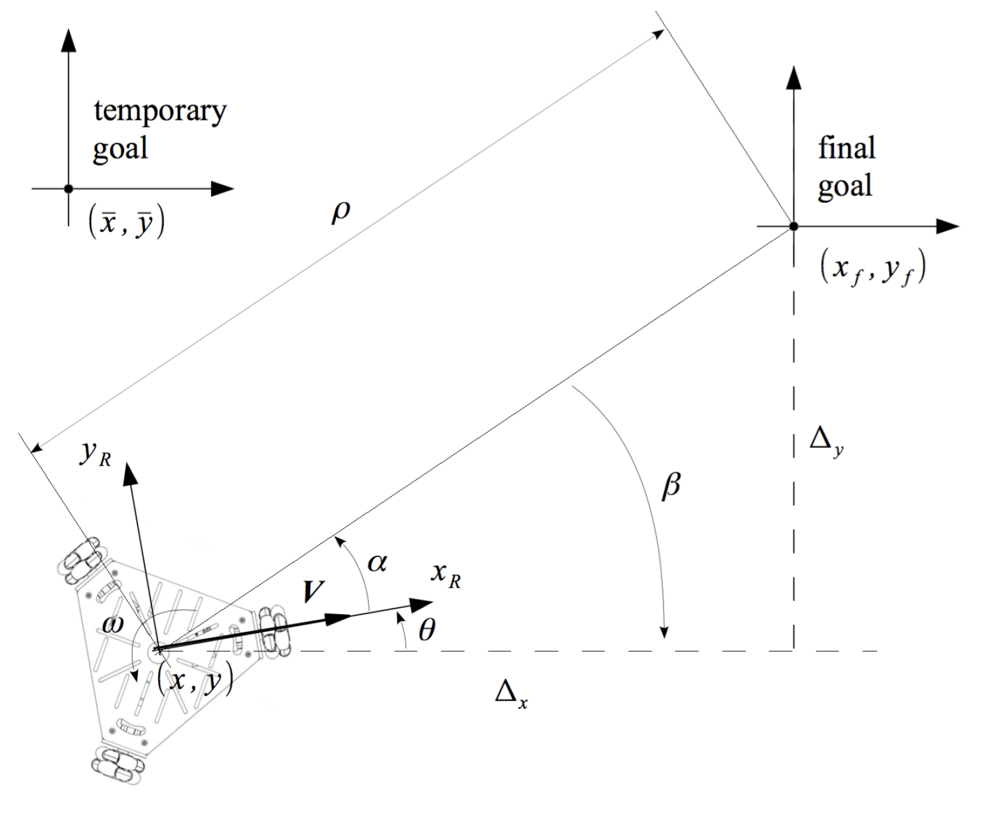
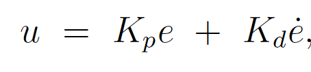
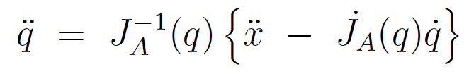
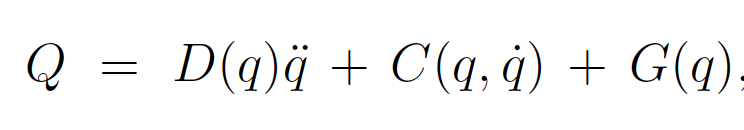
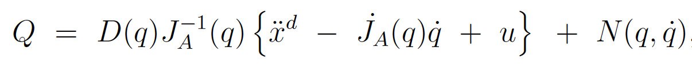
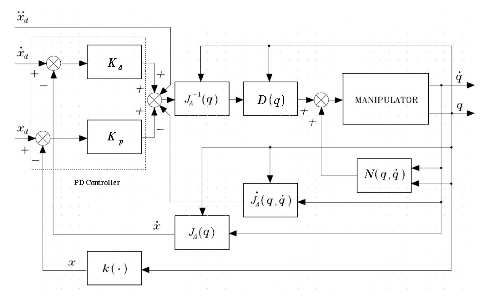

# Example Projects on Robot Control

Lab material and diagrams were provided by ELE 719 and ELE 819 course instructor (Dr. Yao-Chon (John) Chen) @ TMU.

## Wheeled Robot Control (from ELE719)

This lab project is about obstacle avoidanc and motion control of a 3-wheel-drive robot. The motion control involves using forward kinematics for computing the robot velocity based on the wheel velocities, and vice versa using inverse kinematics. Then, for obstacle avoidance, the system detects an obstacle if one of the IR sensor measurements is beyond a certain safe threshold, computes collision-free paths (vectors) towards temporary safe goals, and then bringing the robot back to the original goal once safe. 

## Manipulator Control (from ELE819)

Here, I was tasked to build an operational space inverse dynamics controller with feedback linearization. The system's ultimate goal is to compute the required joint torques based on the operational space (end-effector) reference trajectories.

First, the outer loop control variable u is made linear with respect to the operational space feedback variables using PD controller gains.  

Then, joint accelerations are related to the end effector acceleration based on the inverse analytical Jacobian.  

The output torque vector (Q), with the dynamics equation of a robotic manipulator is

Thus, in terms of the end effector feedback and acceleration, accounting for the steps above, the output torque vector would be    

This can be represented as a block diagram as such:   
